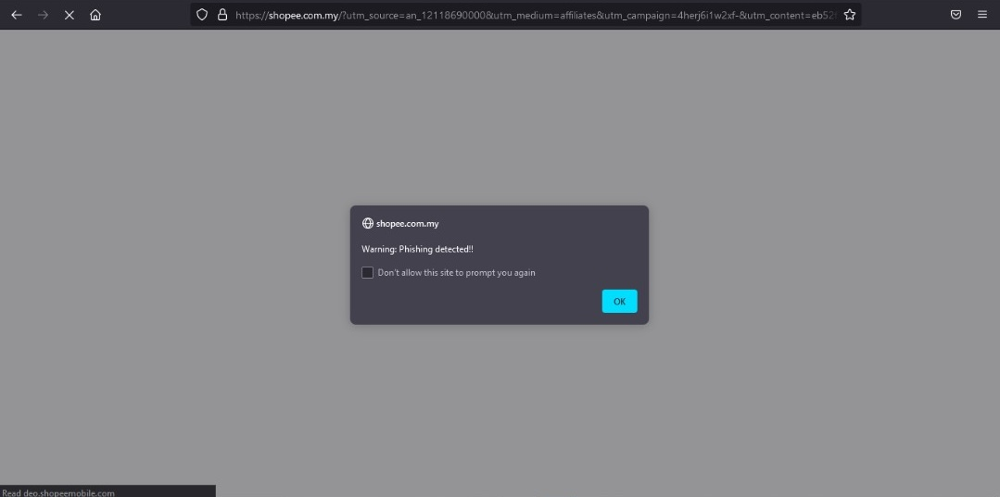

## How to install?
1. Open 'about:debugging' in URL
2. Load temperory extension.
3. Choose manifest.json.
4. Yo! It's installed ;)

## Test
Open a phishing website, and it will show alert

# Results
