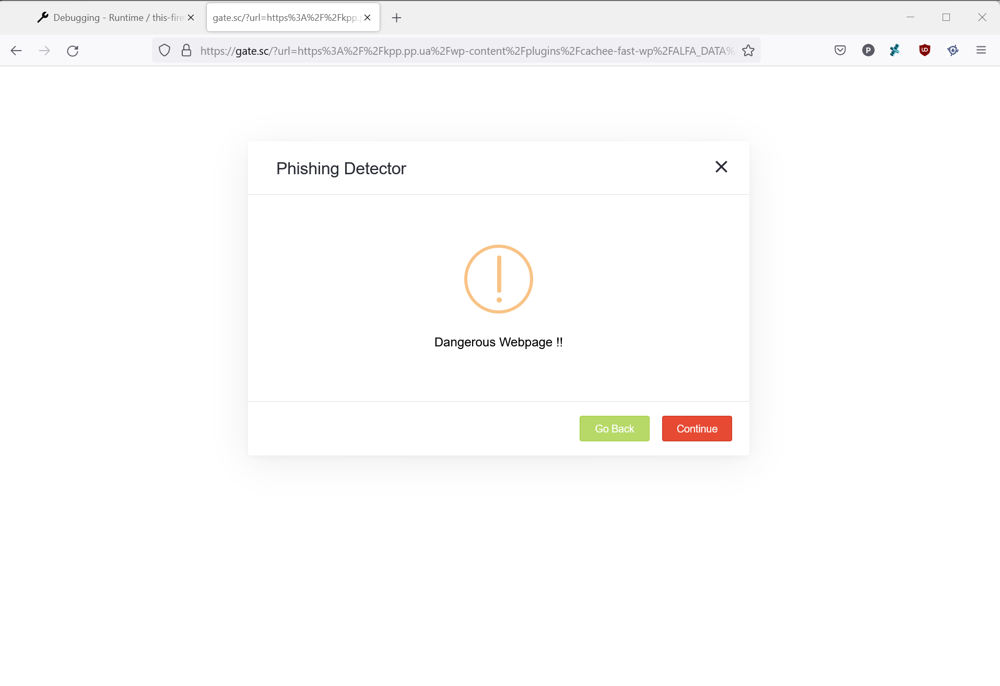
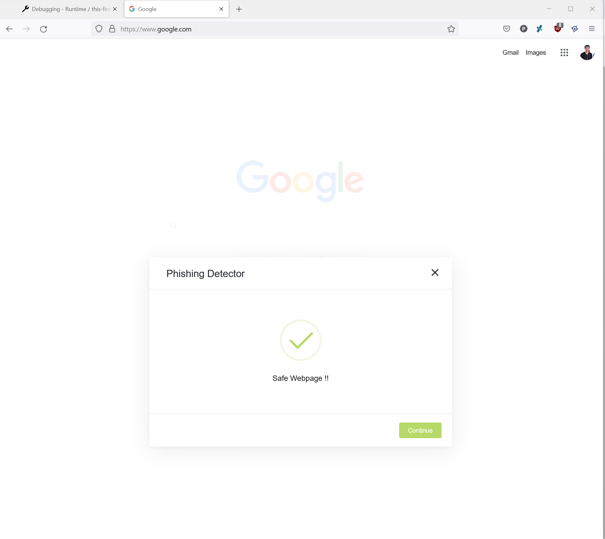

## How to install?
1. Open 'about:debugging' in URL
2. Load temporary extension.
3. Choose manifest.json.
4. Yo! It's installed ;)

## Test
Open a phishing website, and it will show alert

# Results
### Phishing website
;
1. As user access dangerous website, it will notify user and ask whether to continue or go back.
2. User can click on Continue, and later check the status by clicking on extension icon again.

### Safe website

1. On safe website, extension doesn't automatically notify the status.
2. User can click on extension icon to check the safe status.
